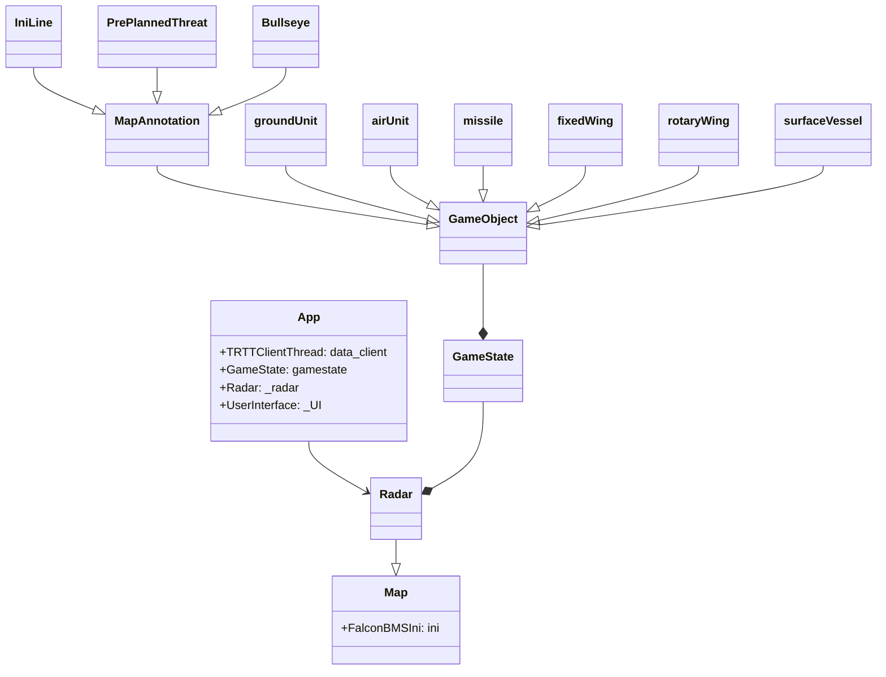
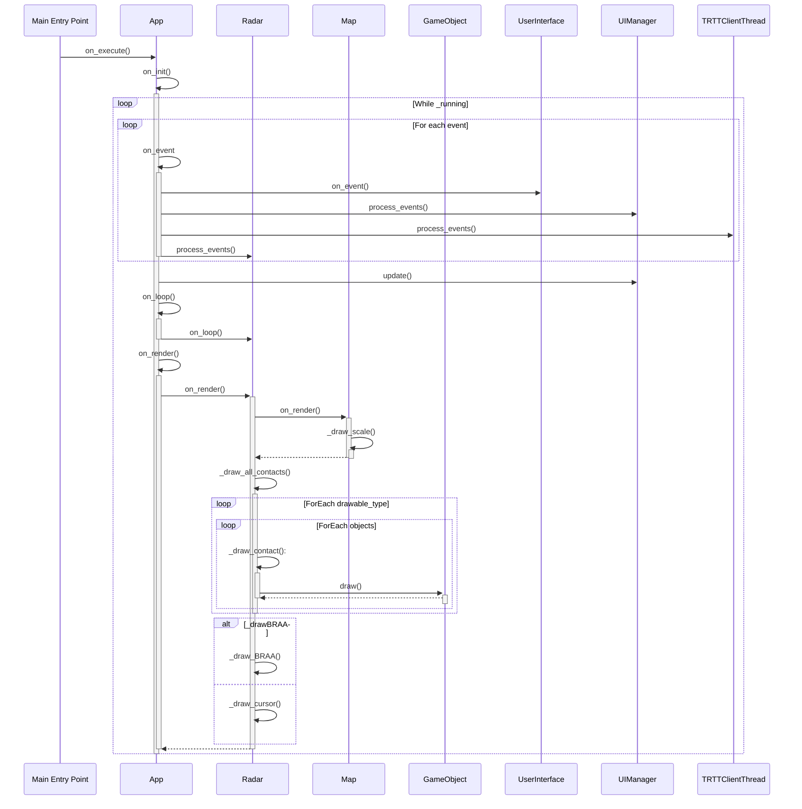

## Class Diagram

```mermaid
classDiagram

    %% The main application class for the OpenRadar program.
    class App {
        +TRTTClientThread: data_client
        +GameState: gamestate
        +Radar: _radar
        +UserInterface: _UI
    }

    class Map {
        +FalconBMSIni: ini
    }

    App --> Radar

    class Radar {
    }
    Radar --|> Map

    class GameState {
    }
    GameState --* Radar

    class GameObject {
    }
    GameObject --* GameState

    class MapAnnotation {
    }
    MapAnnotation --|> GameObject

    class IniLine {
    }
    IniLine --|> MapAnnotation

    class PrePlannedThreat {
    }
    PrePlannedThreat --|> MapAnnotation

    class Bullseye {
    }
    Bullseye --|> MapAnnotation

    class groundUnit {
    }
    groundUnit --|> GameObject

    class airUnit {
    }
    airUnit --|> GameObject

    class missile {
    }
    missile --|> GameObject

    class fixedWing {
    }
    fixedWing --|> GameObject

    class rotaryWing {
    }
    rotaryWing --|> GameObject

    class surfaceVessel {
    }
    surfaceVessel --|> GameObject

```

## Sequence Diagram

```mermaid
sequenceDiagram

    participant main as Main Entry Point
    participant app as App
    participant _radar as Radar
    participant map as Map
    participant obj as GameObject

    %% start app and initialization
    main->>app: on_execute()
    app->>+app: on_init()

    %% main loop
    loop While _running

        %% on event loop
        loop For each event
            app->>+app: on_event
                app->>UserInterface: on_event()
                app->>UIManager: process_events()
                app->>TRTTClientThread: process_events()
                app->>_radar: process_events()
            deactivate app
        end 
        %% on event loop end

        app->>UIManager: update()

        %% on loop events but seems placeholder for now
        app->>+app: on_loop()
            app->>_radar: on_loop()
        deactivate app
        %% on loop events end

        %% render loop
        app->>+app: on_render()
            app->>+_radar: on_render()

                %% on render events
                _radar->>+map: on_render()
                    map->>+map: _draw_scale()
                        %% some map picture drawing ?
                    deactivate map
                map -->>- _radar: 
                %% on render events end

                %% starts drawing each contacts
                _radar->>+_radar: _draw_all_contacts()
                    loop ForEach drawable_type
                        loop ForEach objects
                            _radar->>+_radar: _draw_contact():
                                _radar->>+obj: draw()
                                obj-->>-_radar: 
                            deactivate _radar
                        end
                    end 
                deactivate _radar
                %% drawing each contacts end

                %% cursor render
                alt _drawBRAA
                    _radar->>_radar: _draw_BRAA()
                else
                    _radar->>_radar: _draw_cursor()
                end
                %% cursor render end

            _radar-->>-app: 
        deactivate app
        %% rander loop end

    end
    %% main loop end

    deactivate app
```
